::: {.callout-note appearance="simple"}
Quarto Hub is an experimental preview from the Quarto team. For now, only Google accounts the team has approved can sign in. If yours has been approved, this page walks you through your first project. If not yet, the [overview](index.qmd) explains what Hub is and where it is going.
:::

## Before you start

**You will need** a Google account that the Quarto team has approved for the preview, and a current browser. Nothing to install.

**By the end** you will have created a website project, edited it in both the source and the rendered preview, shared it with someone, and organized it into a collection.

::: {.resources}
[New to Quarto?]{.eyebrow}

Hub is an editor for [Quarto](https://quarto.org), an open-source system for writing documents, websites, and slides in plain text. You don't need to know it well to follow along. These four pages cover the terms used below.

- [What Quarto is, in five minutes](https://quarto.org/docs/get-started/) — the tour of Quarto itself.
- [Markdown basics](https://quarto.org/docs/authoring/markdown-basics.html) — headings, lists, links, images. This is what you type in the source pane.
- [The YAML header](https://quarto.org/docs/get-started/hello/text-editor.html#rendering) — the block between `---` lines at the top of a file, where a document's title and format are set.
- [Websites](https://quarto.org/docs/websites/) and [presentations](https://quarto.org/docs/presentations/) — the two project types this guide uses.
:::

## 1. Sign in

Go to [public-preview.quarto-hub.com](https://public-preview.quarto-hub.com) and sign in with the Google account that was approved for the preview.

Signing in lets you **create and own** projects. People you share a link with can open, read, and comment without owning anything. During the preview, though, their Google account must also be approved, and they must have signed in at least once.

::: {.shot .narrow}
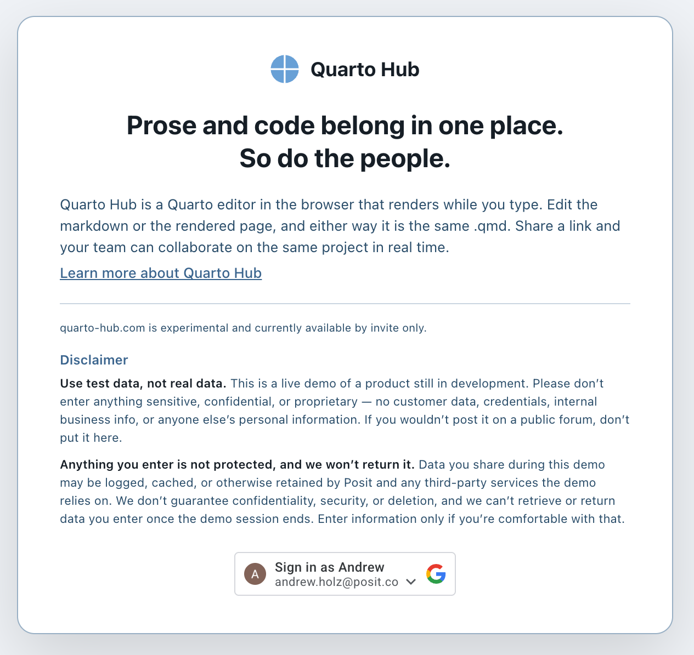
:::

::: {.checkpoint}
**You should now see** your projects page. The first time it says **No projects yet**, with a **＋ New project** button in the middle and a **＋ New** button in the upper right. Either one works.
:::

## 2. Create a project

A **project** in Hub is a Quarto project: a folder with a `_quarto.yml` configuration file, one or more `.qmd` documents, and any images the documents use. Everything you make in Hub is a project, even a single document.

Click **＋ New**. A menu lists the Quarto project types you can start from: **Default** (one document), **Website**, **Blog**, **Manuscript**, and **Book**. Choose **Website**, type a name, and click **Create**. Hub creates the starter files and opens the project.

::: {.shot}

:::

::: {.checkpoint}
**You should now see** the editor, with `index.qmd` open and a rendered page on the right that begins with your project's name.
:::

## 3. The editor

The editor has three panes.

**Files, on the left.** The project's file tree. Click a file to open it. The buttons at the top of the panel create a new file, upload one (a screenshot, a CSV), or download the whole project as a zip. To use a file in a document, drag it from the file tree into the source pane: an image is inserted as an image, and any other file becomes a link to it. You can also type the Markdown yourself, for example ``.

**Source, in the middle.** The text of the open file. A `.qmd` file is Markdown with an optional YAML header and, if you want them, code cells. Hub does not change the format; this is the same file you would edit anywhere else.

**Preview, on the right.** The rendered result, updated as you type.

The three small buttons above the panes switch between source only, split, and preview only.

::: {.shot}
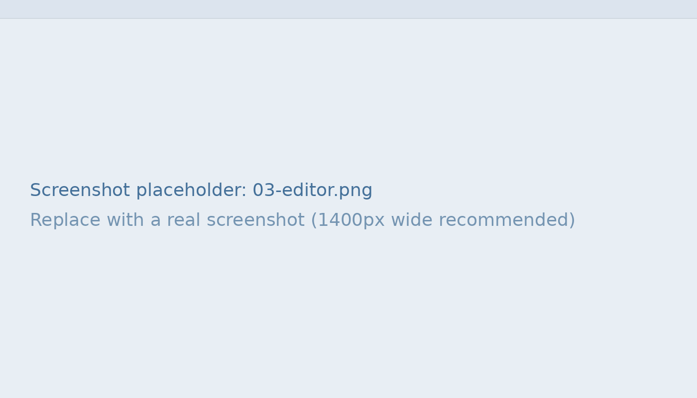
:::

::: {.exercise}
**Try it.** In the source pane, change the heading on `index.qmd` and add a sentence below it. Watch the preview update as you type. There is no save button; every change is kept as you make it.
:::

## 4. Edit in the preview with `format: q2-preview`

By default a document uses Quarto's normal HTML format, and the preview is read-only. Hub adds a format of its own, **`q2-preview`**, that makes the preview editable too. Set it in the YAML header at the top of the document:

```yaml
---
title: "Team meeting"
format: q2-preview
---
```

With `q2-preview` set, you can click into the rendered text on the right and type; the source on the left changes to match. You can also select text in the preview and **add a comment**. This is how reviewers who never open the source leave feedback.

Use whichever pane suits the task. Prose is usually easier in the preview. The YAML header, code cells, and layout are easier in the source.

`q2-preview` is for editing in Hub. When you render the project somewhere else, with `quarto render` or `q2 render`, set the format back to `html`, or put the format in `_quarto.yml` and leave it out of the document.

A comment lives in the source too, as `[>> comment text]` right after the text it refers to, so it travels with the file and appears in the history like any other edit.

::: {.shot}
![The same comment in both panes: as a bubble in the preview, and as `[>> …]` text in the source.](images/get-started/03b-preview-editing.png)
:::

::: {.exercise}
**Try it.** Add `format: q2-preview` to `index.qmd`. Click a word in the preview and retype it. Then select a sentence in the preview and add a comment; find it in the source.
:::

## 5. The bar along the bottom

The strip at the bottom of the editor tells you what is happening to the project.

::: {.shot}
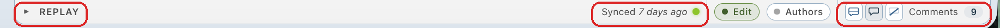
:::

**Replay**, on the left, opens the project's history.

::: {.shot}
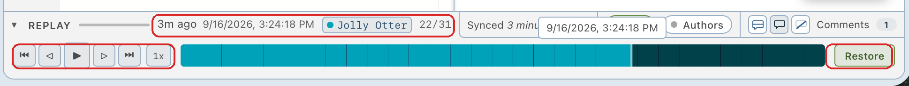
:::

Press play, or step through change by change, and the document rewinds and replays in the editor. The label above the timeline shows when each change was made and by whom, so you can see who wrote a paragraph or what an agent did. The teal part of the bar is the history you have played through; the dark part is what comes after. If you want to go back to an earlier state for real, stop there and click **Restore**.

**Synced**, with the green dot, means your changes have reached the server and everyone else's have reached you. If you lose your connection it reads **Offline**; keep working, and it syncs when you are back.

**Edit** and **Authors** switch the preview between plain editing and a view that shows who wrote what. The **Comments** controls on the far right show or hide comments and count the open ones.

## 6. Share it

Click the **share** icon next to the project name at the top of the file panel.

::: {.shot .inline}
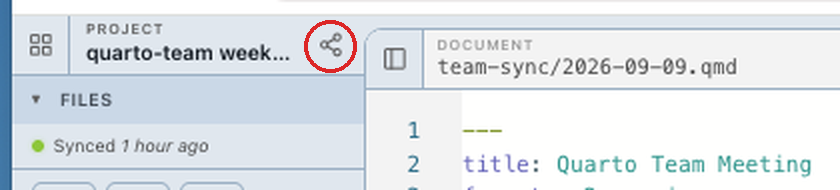
:::

The **Share project** dialog shows a **Shareable link**; click **Copy link** and send it to a colleague.

When they open it, they see the same editor you do. Their cursor shows up in your source pane with their name on it; their edits appear as they type, and yours appear for them. Both of you can comment in the preview if the document uses `q2-preview`.

During the preview, the person you share with must also have an approved account and have signed in once; a link sent to anyone else will not open. And as the dialog says, anyone with the link can edit the project permanently and the link cannot be revoked, so treat it as you would a link to a shared folder.

::: {.shot .narrow}
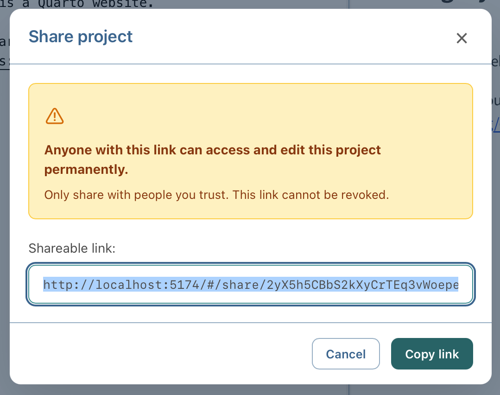
:::

::: {.checkpoint}
**You should now see** a second cursor in the source pane when your colleague starts typing.
:::

## 7. Organize with collections

Return to your projects page with the **grid icon** at the top left of the editor, beside the project name.

::: {.shot .inline}
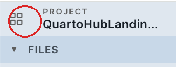
:::

Here you can group projects into **collections**: folders for your own view of the projects page. Projects that are not in any collection sit under **Everything else**. Click **＋ New collection**.

::: {.shot}
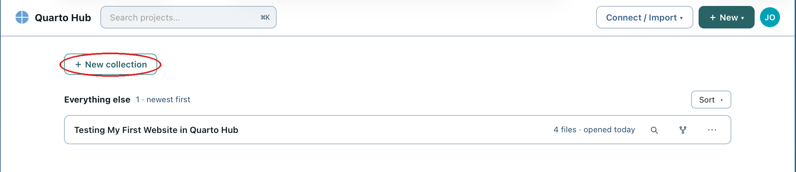
:::

Give the collection a name and click **Create**.

::: {.shot .narrow}
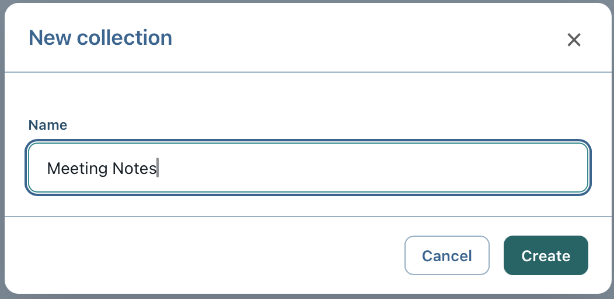
:::

The new collection appears as a section at the top of the page, empty. To move a project into it, drag the project's row onto the collection, or open the row's **⋯** menu and choose **Add to collection**.

::: {.shot}
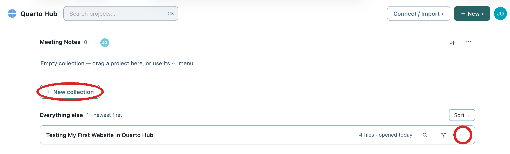
:::

Move projects between collections the same way. Collections change only how the page is arranged for you; they do not change the project or who it is shared with.

::: {.shot}
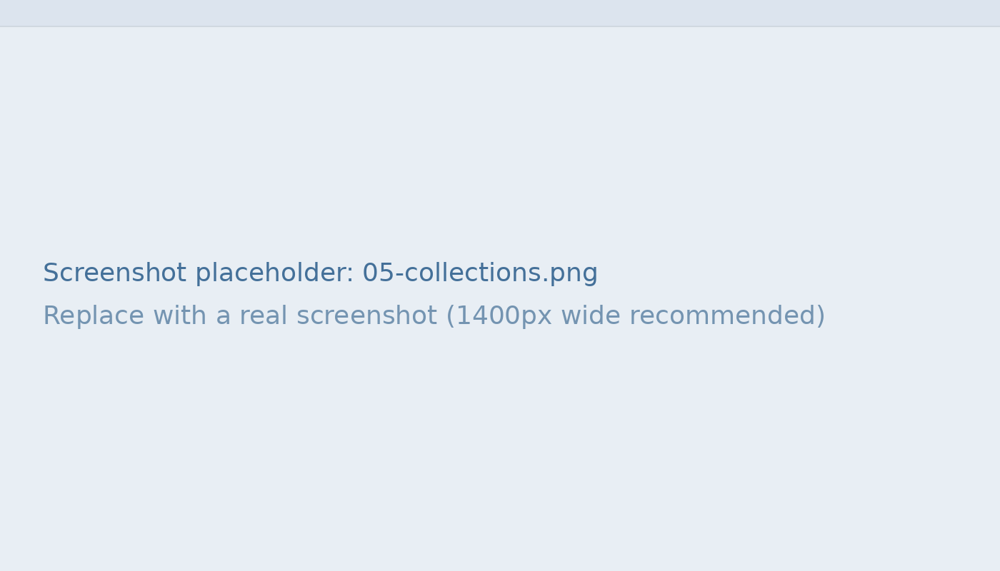
:::

## 8. Fork a project to reuse it

Every project card has a **fork** button, the branching icon between the magnifier and the **⋯** menu. It makes a copy of the project under a new name, with no history carried over. Keep one project as a template (a meeting-notes layout, a slide deck) and fork it each time, instead of starting from the starter files.

::: {.shot .inline}
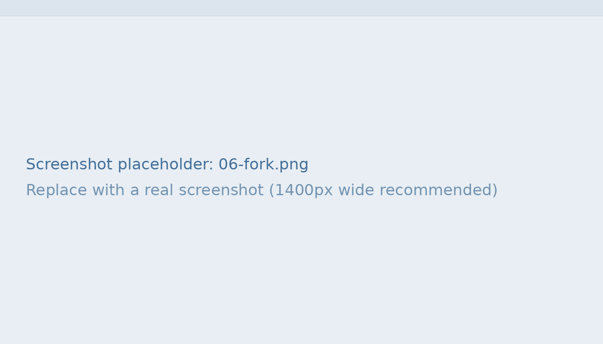
:::

## Recap

You signed in, created a website project, edited it in the source and in the preview, read the status bar, shared it, organized it into a collection, and forked it. That is most of what Hub does today.

**Where to go next**

- For slides, create a Default project and set `format: revealjs` in the YAML header; the preview shows the deck. Quarto's [presentations guide](https://quarto.org/docs/presentations/) covers the rest.
- [How it works](how-it-works.qmd) explains what is underneath: local-first sync, full history, and rendering in the browser.
- Hub is experimental. If you make something you would mind losing, download a zip from the file panel now and then.
- If something breaks, or a step here didn't match what you saw, [file an issue](https://github.com/quarto-dev/quarto-hub/issues). That is what the preview is for.
