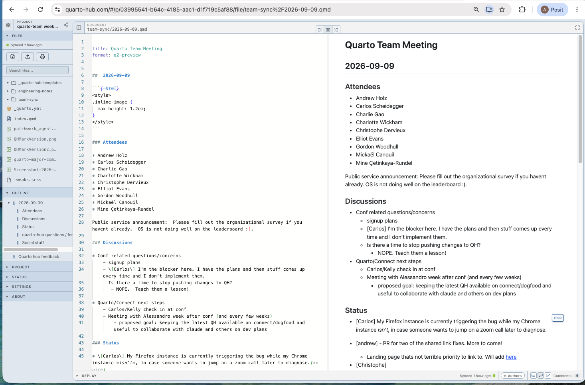

::: {.hero-banner}

::: {.content-block}

[Quarto Hub · Preview]{.eyebrow}

# Code and prose belong in one document. [So do the people.]{.line}

::: {.lead}

Quarto Hub is a Quarto editor in the browser that renders while you type. You edit the Quarto markdown (source) or directly make changes in the rendered page, and either way it's the same `.qmd` underneath. When you want input, you share a link: teammates and agents edit and comment in your project, not in a PDF someone emails back.

:::

::: {.hero-actions}

[Open Hub](https://quarto-hub.com){.btn .btn-primary .btn-lg role="button"}
[How it works](how-it-works.qmd){.btn .btn-outline-secondary .btn-lg role="button"}

[Today Hub is best for markdown-to-HTML projects: websites, notes, slides. There is much more to come.]{.scope}

:::

:::

:::

::: {.content-block}

::: {.frame}

{fig-alt="The Quarto Hub editor: project files on the left, .qmd source in the middle, the rendered page on the right with an inline comment."}

:::

::: {.why}

[Why]{.eyebrow}

## The missing piece

Quarto's premise is that code, analysis and writing belong in one artifact. Markdown which can be used to reproduce results and be versioned. What has been missing is the other half tools like Google Docs provide: several people in the same document at once, comments where the words are, no one waiting for a render or a pull request. Hub adds that half without giving up the critical underlying source.

:::

:::

::: {.alt-background}
::: {.content-block}

[Today]{.eyebrow}

## What works today

::: {.card-grid .four}
::: {.hub-card}
### Websites and docs
The whole project: file tree, outline, every page rendered as you edit it.
:::
::: {.hub-card}
### Slides
revealjs decks, edited and previewed in place. Your co-presenter gets the link, not a PDF.
:::
::: {.hub-card}
### Meeting notes
One `.qmd` the whole team types into during the call. It's rendered before the call ends.
:::
::: {.hub-card}
### Agents
Point your favorite LLM at the project. It edits the same files you do, and every change stays in the history.
:::
:::

Anyone with the link can open the project, read it, and comment. They don't need an account or a Quarto install. You sign in with Google to create and own projects.

:::
:::

::: {#coming-soon .content-block}

[Coming soon]{.eyebrow}

## Next

::: {.card-grid .two}

::: {.hub-card .soon}

### Hosted code execution

R and Python cells run in Hub itself, with nothing installed. Today they run when a project member has Quarto 2 running locally, and what runs is still limited.

:::

::: {.hub-card .soon}

### Positron

Open the Hub project in Positron. Your edits and the browser's will work seamlessly in the same document.

:::

:::

Hub is built so that whoever has the project open, a teammate, an agent, or you in a different editor, is working on the same source with the same history.

:::

::: {.alt-background}

::: {.content-block}

[Built on Quarto 2]{.eyebrow}

## The engine underneath

Rendering on every keystroke requires a much faster version of Quarto. That is Quarto 2: the engine rewritten in Rust, an order of magnitude faster than Quarto 1, and small enough to run inside the browser tab. You don't need to install anything to use Quarto 2 in Hub; it's already there.

**Quarto 2 is highly functional but still experimental. It is the future of Quarto but Quarto 1/quarto-cli will be supported for many years to come. Over time more of what you use for your daily work will be available in Quarto 2, and we hope the significant improvements in performance, improved errors, and a source-mapped document model that editors, tools, and agents can build on prove worth transitioning to.**

::: {.stack-row .hub}

[Quarto Hub]{.stack-name}

The editor and hosting. Where you work on a project.

:::

::: {.stack-row .q2}

[Quarto 2]{.stack-name}

The engine. Runs natively and in the browser. Experimental today; where Quarto is going.

:::

::: {.stack-row}

[`quarto-cli`]{.stack-name}

Quarto 1. Still supported, still what you install today for production work.

:::

:::

:::
